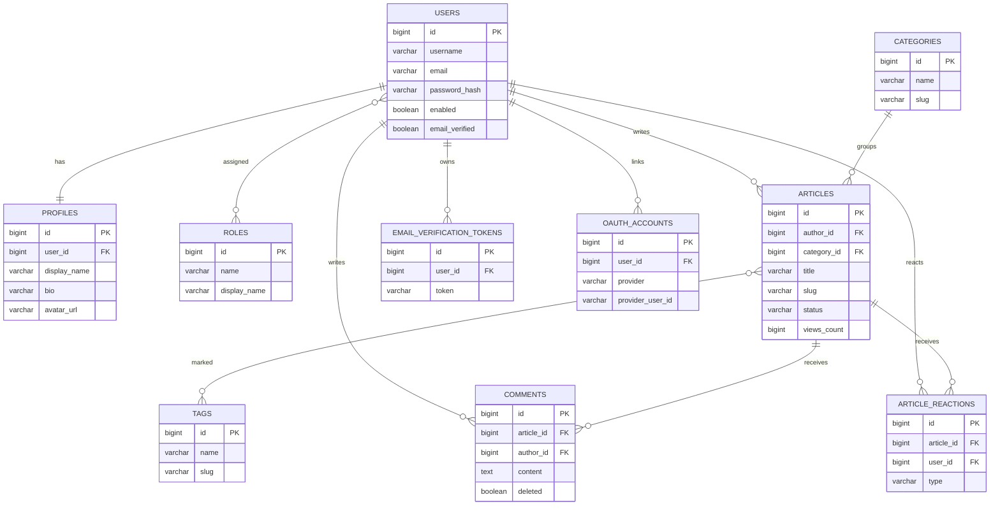

# ER diagram

```mermaid
erDiagram
    USERS ||--|| PROFILES : has
    USERS }o--o{ ROLES : assigned
    USERS ||--o{ ARTICLES : writes
    USERS ||--o{ COMMENTS : writes
    USERS ||--o{ ARTICLE_REACTIONS : reacts
    USERS ||--o{ EMAIL_VERIFICATION_TOKENS : owns
    USERS ||--o{ OAUTH_ACCOUNTS : links

    CATEGORIES ||--o{ ARTICLES : groups
    ARTICLES }o--o{ TAGS : marked
    ARTICLES ||--o{ COMMENTS : receives
    ARTICLES ||--o{ ARTICLE_REACTIONS : receives

    USERS {
        bigint id PK
        varchar username
        varchar email
        varchar password_hash
        boolean enabled
        boolean email_verified
    }

    PROFILES {
        bigint id PK
        bigint user_id FK
        varchar display_name
        varchar bio
        varchar avatar_url
    }

    ROLES {
        bigint id PK
        varchar name
        varchar display_name
    }

    ARTICLES {
        bigint id PK
        bigint author_id FK
        bigint category_id FK
        varchar title
        varchar slug
        varchar status
        bigint views_count
    }

    CATEGORIES {
        bigint id PK
        varchar name
        varchar slug
    }

    TAGS {
        bigint id PK
        varchar name
        varchar slug
    }

    COMMENTS {
        bigint id PK
        bigint article_id FK
        bigint author_id FK
        text content
        boolean deleted
    }

    ARTICLE_REACTIONS {
        bigint id PK
        bigint article_id FK
        bigint user_id FK
        varchar type
    }

    EMAIL_VERIFICATION_TOKENS {
        bigint id PK
        bigint user_id FK
        varchar token
    }

    OAUTH_ACCOUNTS {
        bigint id PK
        bigint user_id FK
        varchar provider
        varchar provider_user_id
    }
```
